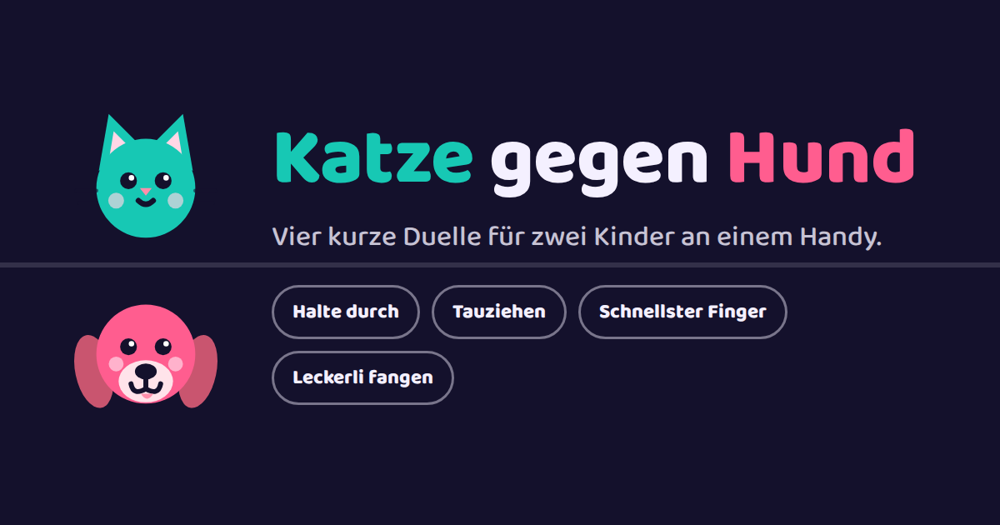

# Katze gegen Hund

Vier kurze Duelle für zwei Kinder an **einem** Handy. Das Handy liegt flach auf
dem Tisch, ein Kind sitzt an jeder Seite: Die obere Bildschirmhälfte gehört der
Katze und ist gedreht, die untere gehört dem Hund.



## Die vier Spiele

| Spiel | So geht es | Gewonnen hat, wer … |
| --- | --- | --- |
| **Halte durch** | Finger auf die eigene Hälfte legen und halten. Wird alles rot: sofort loslassen. | zuerst 100 Punkte hat. Wer beim Rot noch hält, verliert 18 Punkte. |
| **Tauziehen** | Den weißen Punkt auf der eigenen Hälfte treffen, dann springt er weiter. | zehn Nettotreffer Vorsprung schafft und die Trennlinie bis zum Rand schiebt. |
| **Schnellster Finger** | Warten, bis alles grün wird, dann tippen. Zu früh getippt heißt Durchgang verloren. | zwei Durchgänge gewinnt. |
| **Leckerli fangen** | Links oder rechts auf der eigenen Hälfte gedrückt halten, um zu laufen. | zuerst 100 Punkte gefangen hat. Jedes Leckerli zählt 7. |

Der Gesamtstand zwischen Katze und Hund läuft über alle Spiele weiter und
bleibt auch nach dem Schließen der Seite erhalten. `Punkte löschen` im Menü
setzt ihn wieder auf 0 : 0.

## Spielen

Das Spiel braucht einen **Touchscreen** – zwei Finger auf zwei Hälften gehen
mit der Maus nicht. Am Rechner lässt sich mit der Maus nur ausprobieren, wie
sich ein Spiel anfühlt.

Als App aufs Handy: Seite im Browser öffnen und `Zum Startbildschirm
hinzufügen` wählen. Dann startet das Spiel im Vollbild, ohne Adressleiste, und
läuft auch ohne Netz. Während eines Spiels bleibt der Bildschirm an, damit er
nicht mitten im Duell dunkel wird.

## Aufbau

Kein Build, keine Abhängigkeiten – `index.html` ist das ganze Spiel und lädt
nichts nach. Die Schrift steckt als `data:`-URL in der Datei, die Tiergesichter
sind SVG im Menü und dieselben Formen noch einmal als Canvas-Zeichnung für
`Leckerli fangen`.

```
index.html              Spiel, Grafik, Ton und Schrift in einer Datei
sw.js                   legt die Dateien ab, damit es offline startet
manifest.webmanifest    Angaben für "Zum Startbildschirm hinzufügen"
icons/                  App-Icon (SVG plus PNG) und Vorschaubild für Links
schriften/              Baloo 2 als woff2 plus Lizenz
```

Zum Ausprobieren reicht ein beliebiger statischer Server im Projektordner, zum
Beispiel `npx serve .` oder `python3 -m http.server`. Direkt per Doppelklick
(`file://`) läuft das Spiel auch, nur den Service Worker gibt es dann nicht.

Nach einer Änderung an `index.html` die Nummer in `LAGER` in `sw.js`
hochzählen, sonst bekommen Geräte mit installierter App noch die alte Fassung.

## Veröffentlichen

`.github/workflows/pages.yml` schiebt bei jedem Push auf `main` den ganzen
Ordner zu GitHub Pages. Einmalig muss dafür unter **Settings → Pages** als
*Source* **GitHub Actions** eingestellt sein. Danach liegt das Spiel unter
`https://nickyreinert.github.io/katze-gegen-hund/`.

## Schrift

[Baloo 2](https://fonts.google.com/specimen/Baloo+2) von Ek Type, unter der SIL
Open Font License 1.1 – siehe `schriften/Baloo2-OFL.txt`. Eingebettet ist der
lateinische Ausschnitt der Variable-Font-Fassung.
